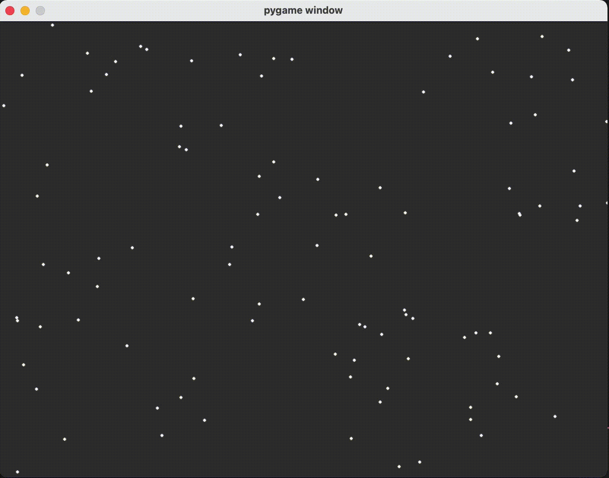
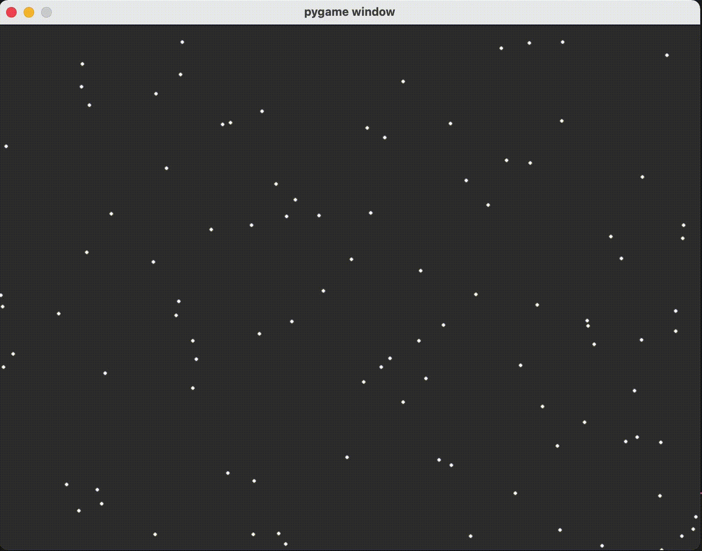
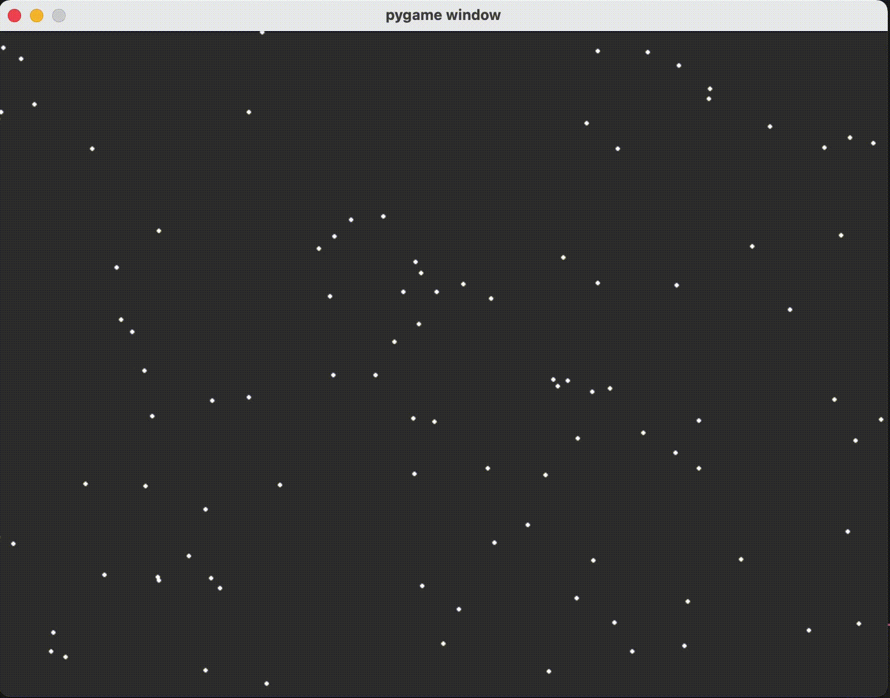

# SwarmBehaviour  
   
Several swarm behavior approaches have been coded. The coding of this project was inspired by [here](https://vergenet.net/~conrad/boids/pseudocode.html). The basic swarm model consists of three simple steering behaviors which describe how an individual member maneuvers based on the positions and velocities its nearby member
* __Separation__: steer to avoid crowding local members
* __Alignment__: steer towards the average heading of local members
* __Cohesion__: steer to move toward the average position of local members


Each member in the swarm has position, velocity and acceleration vectors. Apart from these, there are also a few forces applied to the members. By changing the effects of these forces or removing them completely, the effects of other forces can be seen more clearly. The swarm can be observed below under the influence of different forces.
____
* Alignment  
  
   
 
____
  

* Separation + Alignment  
  
      
 
____
* Cohesion  
  
   
 
____

* Cohesion + Alignment   
   
  
 
____
* Separation + Alignment + Cohesion 
  
   
 
____   

How to run code ?  
```
  make install
```
and then;
```
  python main.py
```

## References
* Computer Graphics, Principles and Practice by Foley, van Dam, Feiner and Hughes, Addison Wesley 1990  
* http://www.red3d.com/cwr/papers/1987/SIGGRAPH87.pdf
* http://www.red3d.com/cwr/nobump/nobump.html


